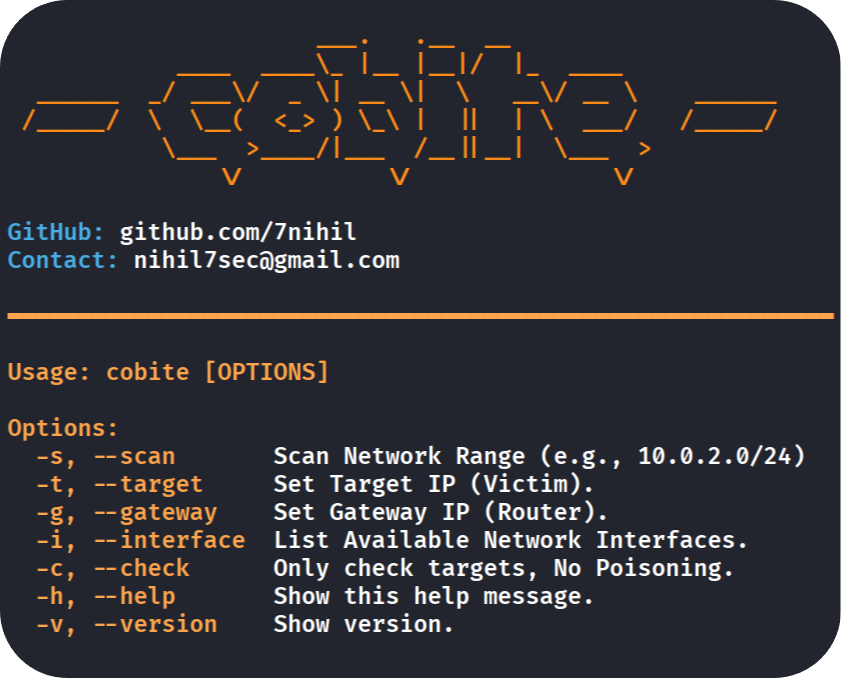

<h1 align="center">
$${\color{orange}\text{COBITE | ARP POISONING - MITM TOOL}}$$
</h1>
<p align="center">

</p>
  
> [!WARNING]
> **The Cobite Tool should be used within an ethical framework for training purposes, based on the fundamentals of ARP poisoning and MITM attacks. Users are responsible for any unethical use.**
<h1>
$${\color{orange}\text{-> Features <-}}$$</h1>

* **ARP Poisoning:** Redirects local network traffic to intercept data between the target and the gateway.
  
* **Interface Listing:** Automatically detects and lists all available network interfaces for easy selection.
  
* **Check Before Poisoning:** Performs a pre-scan to verify target status and network stability before launching the attack.

* **Network Scanning:** Lists IP addresses within any network range.
<h1>
$${\color{orange}\text{-> Installation <-}}$$
</h1>

- $\color{orange}{\text{Open the terminal, and write this commands for cloning repository and installing required libraries;}}$

```bash
> git clone https://github.com/7nihil/cobite.git 

> cd cobite
                                     
> pip install -r requirements.txt
```
- $\color{orange}{\text{1.Option | Execute with Python;}}$
```bash
> sudo chmod +x cobite.py

> python3 cobite.py

```
- $\color{orange}{\text{2.Option | Execute with /usr/local/bin;}}$
```bash
> sudo cp cobite.py /usr/local/bin/cobite && sudo chmod +x /usr/local/bin/cobite

> cobite
```

- $\color{orange}{\text{Contact;}}$
```bash
> nihil7sec@gmail.com
```
